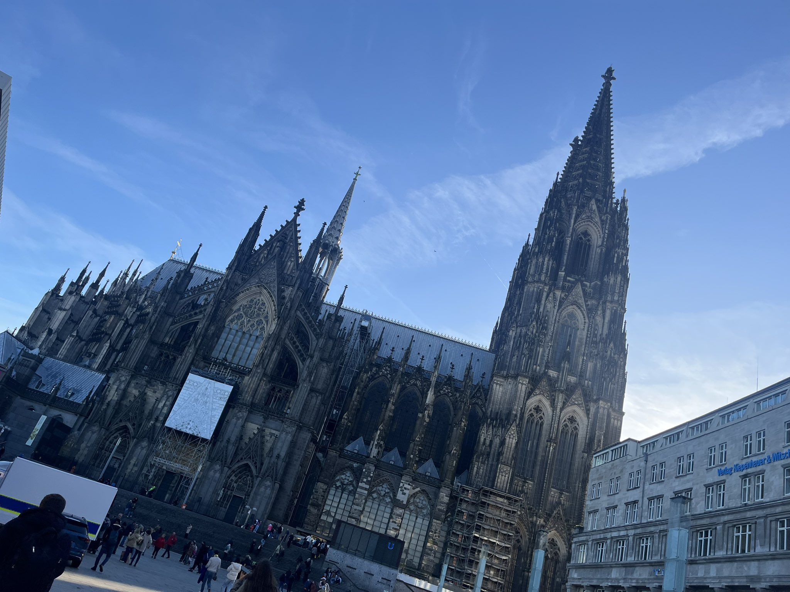
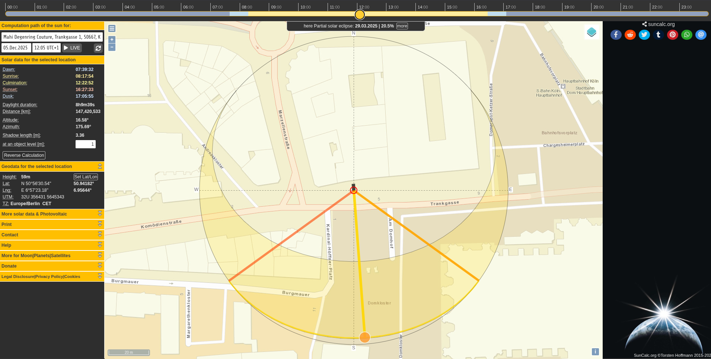
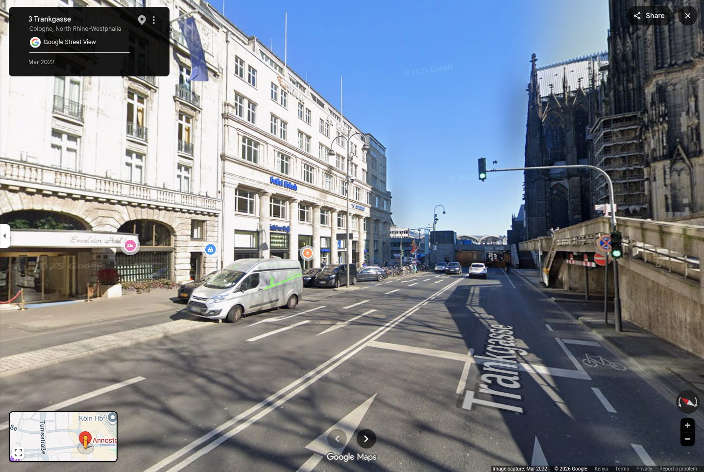
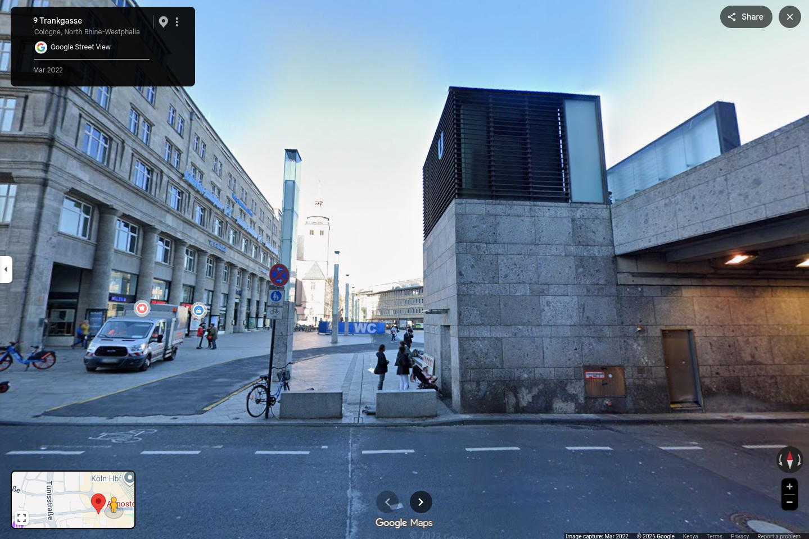
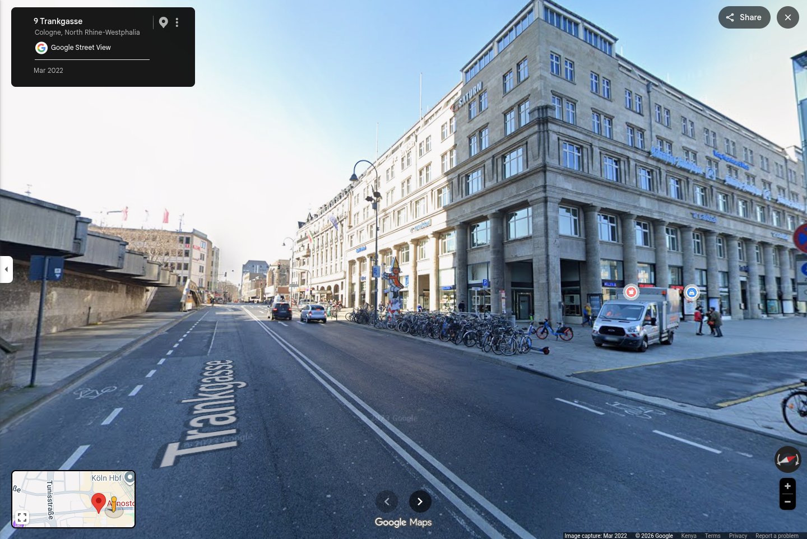
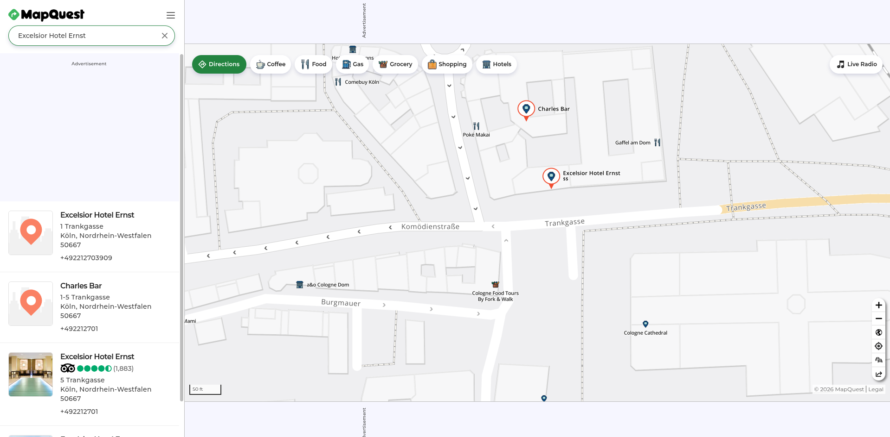
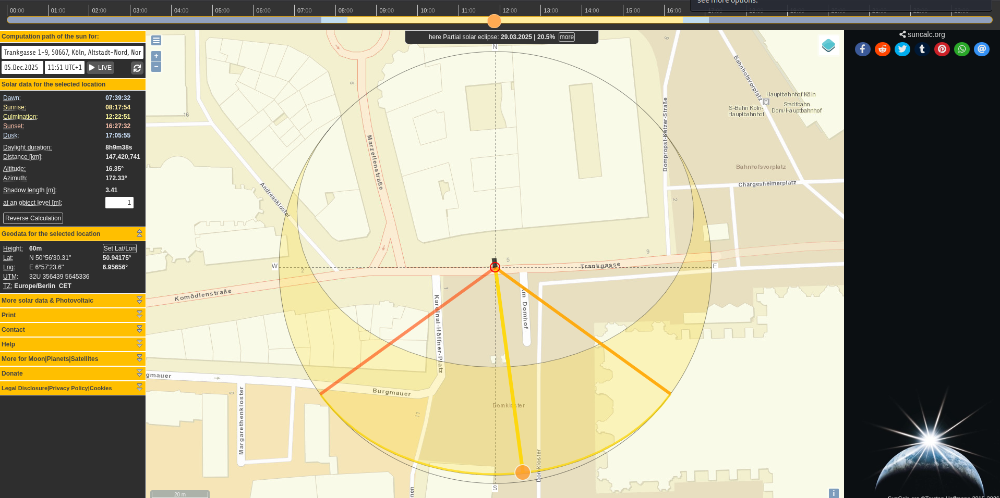

# Analysis: Chronolocation and Spatial Orientation

---

## 1. Initial Landmark Identification
The investigation began with analysis of visible text within the image. A readable structure label identified the name:
* **"Verlag Kiepenheuer"**

Further visual inspection revealed a recognizable architectural landmark consistent with:
* **Cologne Cathedral (Kölner Dom)**

Correlation of both landmarks established the probable investigation region as:
* **Cologne, Germany**

This provided the geographic foundation required for environmental and solar reconstruction.

---

## 2. Geographic and Solar Context
Germany is located in the Northern Hemisphere. This establishes a predictable solar path pattern:

`East → South → West`

At approximately midday, the sun occupies the southern portion of the sky. This became an important reference point during subsequent orientation analysis.

---

## 3. Structural Correlation and Area Reconstruction
Using satellite mapping and surrounding structural comparison, the visible environment was matched against known locations surrounding Cologne Cathedral. The following structures and locations were identified:

* **Excelsior Hotel Ernst**
* **Trankgasse road**
* **Cologne Cathedral surroundings**

This allowed reconstruction of the approximate scene geometry and observer orientation.

---

## 4. Road Orientation Analysis
Visual examination of Trankgasse suggested that the road runs approximately along an east-west axis. This assessment was supported through:

1. Map alignment
2. Satellite imagery
3. Surrounding building placement

The road orientation became relevant when estimating the probable solar direction relative to the observer viewpoint.

---

## 5. Solar Illumination Analysis
The image showed direct sunlight illuminating the entrance façade of Excelsior Hotel Ernst.

* **Inference:** The entrance was facing toward the active solar direction at capture time.

The image also contained visible warm golden illumination characteristics. This suggested:
* Relatively low-to-medium solar elevation
* Strong directional lighting
* Probable late-morning solar conditions

---

## 6. Sun Position Reconstruction
A solar positioning tool was used for reconstruction: **SunCalc**. The hotel location was loaded into the solar model and solar azimuth positions were tested across multiple time intervals. The reconstruction process focused on:

* Direct sunlight striking the hotel entrance
* Road alignment consistency
* Building orientation
* Observer viewpoint geometry

Multiple simulated solar positions were compared against the image lighting conditions.

---

## 7. Architectural Orientation Analysis
Further scene inspection suggested that the visible "Verlag Kiepenheuer" text orientation faces east. From the observer viewpoint:
* **The left side of the image corresponded to the eastern direction.**

This orientation remained consistent with:
* Hotel entrance illumination
* Trankgasse alignment
* SunCalc solar azimuth simulations

The reconstructed geometry suggested that the sun was positioned toward the southeast portion of the scene during image capture.

---

## 8. Solar Time Approximation
SunCalc simulations indicated that direct southeast-facing solar illumination aligned with the hotel entrance between approximately:
* **11:30 AM — 12:15 PM**

This interval consistently matched:
* Façade illumination direction
* Environmental lighting behavior
* Reconstructed building orientation
* Visible solar intensity

---

## 9. Analytical Conclusion
The image was most likely captured during late morning, approximately between:
* **11:30 AM — 12:00 Noon**

The conclusion was derived using:
* Landmark correlation
* Geographic hemisphere analysis
* Architectural reconstruction
* Road orientation analysis
* Solar geometry simulation
* Environmental lighting interpretation

*Note: No metadata, timestamps, or embedded GPS information were used during the investigation.*

---

## 10. Confidence Assessment

| Finding | Confidence |
| :--- | :--- |
| Cologne region identification | High |
| Landmark correlation | High |
| Building orientation reconstruction | Medium |
| Solar direction reconstruction | Medium |
| Estimated capture time | Medium |
